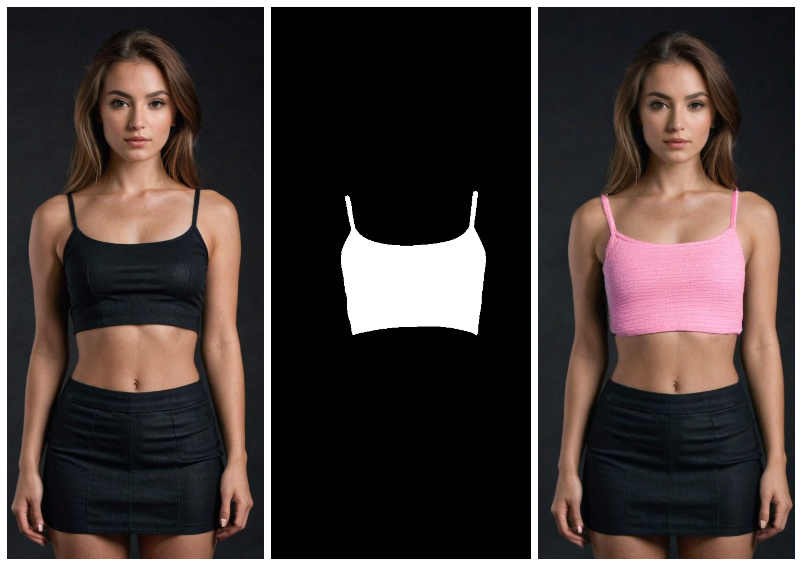

# AI Clothing Fashion Design Generator 
<a name="readme-top"></a>

<!-- ABOUT THE PROJECT -->
## Introduction
The fashion industry has always been at the forefront of innovation, blending artistry with cutting-edge technology. In recent years, advancements in artificial intelligence and machine learning have revolutionized fashion design, allowing for unprecedented creativity and efficiency. One such innovation is the Fashion Design Generator, a sophisticated tool that enables designers to create and visualize new clothing designs with remarkable precision and realism. This generator operates through a seamless integration of three advanced AI models, each contributing a crucial step to the design process.

**Step 1: Generating Realistic Human Figures with RealVisXLV40**

The first step in the Fashion Design Generator involves creating a highly realistic human figure tailored to specific clothing specifications. This is achieved using the RealVisXLV40 model, an advanced AI system renowned for its ability to render lifelike human avatars. Designers input their clothing specifications into the model, which then generates a virtual human figure adorned with the specified garments. This step ensures that the foundational visual representation is accurate and aligned with the designer's vision, providing a realistic base for further customization.

**Step 2: Creating Masks for Clothing Parts with Facebook's Segment-Anything Model**

Once the realistic human figure is generated, the next step is to create precise masks for specific parts of the clothing. This is accomplished using Facebook's Segment-Anything model, a state-of-the-art segmentation tool that can accurately delineate different regions of an image. By applying this model, designers can isolate specific areas of the clothing on the virtual figure, creating masks that highlight the parts to be modified or enhanced. This step is crucial for ensuring that the design alterations are applied accurately and only to the intended sections of the garment.

**Step 3: Applying Garments with IDM-VTON**

The final step in the Fashion Design Generator process involves the application of the desired garment to the masked regions of the virtual clothing. This is done using IDM-VTON, an innovative virtual try-on network designed specifically for fashion applications. IDM-VTON takes the garment specified by the designer and seamlessly integrates it into the masked areas of the clothing, ensuring a perfect fit and realistic appearance. This step not only allows for the visualization of the final design but also provides an opportunity for further refinement and adjustments.

The Fashion Design Generator represents a significant leap forward in the intersection of fashion and technology. By leveraging the power of advanced AI models like RealVisXLV40, Facebook's Segment-Anything, and IDM-VTON, designers can create, visualize, and refine clothing designs with unparalleled ease and precision. This tool not only enhances the creative process but also streamlines production workflows, making it an invaluable asset in the modern fashion industry.



<!-- Used Technologies -->
## Used technologies
### RealVisXL
The RealVisXL model is an advanced AI system designed for generating highly realistic human figures and avatars. It combines deep neural networks and generative models to produce lifelike visual representations. Here are the key technical aspects:

1. Architecture:

* **Generative Adversarial Networks (GANs)**: Includes a generator network to create realistic images and a discriminator network to evaluate their realism.

* **Variational Autoencoders (VAEs)**: Consists of an encoder to compress input data and a decoder to reconstruct human figures from latent representations.

* **Attention Mechanisms**: Utilizes self-attention layers to capture fine details and spatial relationships.

* **Pose Estimation and Adjustment**: Ensures natural and anatomically correct postures.

2. Capabilities:

* **High Realism**: Generates detailed textures, accurate lighting, and shadows.

* **Customization**: Allows extensive customization based on clothing, body shape, and pose specifications.

* **Scalability**: Produces high-resolution images efficiently.

3. Applications:

* **Fashion Design**: Enables virtual try-ons and creation of fashion catalogs.

* **Gaming and Animation**: Creates lifelike characters for games and films.

* **Healthcare and Fitness**: Simulates different body shapes and aids in medical training and virtual rehabilitation programs.

The RealVisXL model achieves high realism, customization, and scalability, making it a versatile tool for fashion design, gaming, animation, and healthcare applications.

### Segment Anything
Facebook's Segment-Anything model is an advanced image segmentation tool designed to achieve high precision and flexibility. It combines convolutional neural networks (CNNs) and transformer architectures to accurately segment objects in images. Here are the key technical aspects:

1. Architecture:

* **Backbone Network**: Uses deep CNNs (e.g., ResNet) to extract hierarchical features.

* **Transformer Encoder**: Applies self-attention to model long-range dependencies and contextual relationships.

* **Segmentation Head**: Uses deconvolutional layers for high-resolution segmentation maps.

* **Multi-Scale Feature Fusion**: Incorporates a feature pyramid network to handle objects of varying sizes.

2. Capabilities:

* **Generalization**: Performs zero-shot segmentation, handling unseen objects effectively.

* **Interactive Segmentation**: Integrates user inputs for refined segmentation.

* **High Precision**: Achieves fine-grained segmentation with accurate object boundaries.

3. Applications

* **Image Editing**: Background removal and object extraction.

* **Medical Imaging**: Segmentation of anatomical structures.

* **Autonomous Driving**: Detection and segmentation of road objects.

* **Fashion Design**: Isolates clothing parts for virtual try-on applications.

The model's combination of CNNs and transformers makes it versatile and highly accurate, suitable for a wide range of applications from image editing to autonomous driving and fashion design.

### IDM-VTON
The IDM-VTON (Image-based Deep Matching Virtual Try-On Network) model is an advanced AI system designed for virtual garment fitting. It uses deep learning to integrate clothing items onto human figures realistically and accurately. Key technical aspects include:

1. Architecture:

* **Clothing Warping Module**: Uses a Geometric Matching Network (GMN) to align the clothing with the human figure by predicting transformation parameters.

* **Human Parsing Network**: Segments the human figure into different body parts using an encoder-decoder network, providing detailed segmentation maps.

* **Try-On Synthesis Module**: Employs a Conditional Generative Adversarial Network (cGAN) to combine the warped clothing with the segmented figure, ensuring realistic synthesis.

* **Refinement Network**: Enhances the final image quality, correcting artifacts and improving coherence.

2. Capabilities:

* **Realistic Fitting**: Ensures accurate clothing fit and natural appearance using detailed segmentation and geometric matching.

* **High-Quality Synthesis**: cGANs and refinement techniques produce visually coherent and realistic try-on images.

* **Flexibility and Adaptability**: Handles various garment types and body poses, allowing for interactive adjustments and personalized fits.

3. Applications:

* **E-Commerce**: Enhances online shopping experiences by allowing virtual try-ons and personalized recommendations.
    
* **Fashion Design**: Aids in design prototyping and customization, reducing the need for physical prototypes.
    
* **Entertainment and Media**: Used in video games, animations, and virtual fashion shows for dynamic character dressing.

The IDM-VTON model significantly advances virtual try-on technology, offering realistic and high-quality garment visualization for diverse applications in e-commerce, fashion design, and entertainment.

<p align="right">(<a href="#readme-top">Back to Top</a>)</p>

<!-- GETTING STARTED -->
## Getting Started - Python
Instructions on setting up your project locally.
To get a local copy up and running follow these simple steps.

### Install dependencies
To install the required packages, in a terminal, type:
  ```sh
  pip install -r requirements.txt
  ```

### Clone IDM-VTON
  ```sh
  git clone https://github.com/yisol/IDM-VTON.git
  ```

### Download models
To download the models, in a terminal, type:
  ```sh
  wget https://civitai.com/api/download/models/361593?type=Model&format=SafeTensor&size=pruned&fp=fp16 --directory-prefix weights --content-disposition

  wget https://dl.fbaipublicfiles.com/segment_anything/sam_vit_h_4b8939.pth --directory-prefix weights

  wget https://huggingface.co/spaces/yisol/IDM-VTON/resolve/main/ckpt/densepose/model_final_162be9.pkl?download=true --directory-prefix idm_vton/ckpt/densepose -content-disposition

  wget https://huggingface.co/spaces/yisol/IDM-VTON/resolve/main/ckpt/humanparsing/parsing_atr.onnx?download=true --directory-prefix idm_vton/ckpt/humanparsing -content-disposition

  wget https://huggingface.co/spaces/yisol/IDM-VTON/resolve/main/ckpt/humanparsing/parsing_lip.onnx?download=true --directory-prefix idm_vton/ckpt/humanparsing -content-disposition

  wget https://huggingface.co/spaces/yisol/IDM-VTON/resolve/main/ckpt/openpose/ckpts/body_pose_model.pth?download=true --directory-prefix idm_vton/ckpt/openpose/ckpts -content-disposition
  ```

### Move try_on.py
  ```sh
  mv try_on.py idm_vton
  ```

### Generate realistic human
In a terminal, type:
  ```sh
  python generate_model.py --prompt "a crop top and mini skirt" --output_path "reference_images/crop_top.png"
  ```

### Create mask
After running the script, you will choose three points over the clothing part you want to create a mask. In a terminal, type:
  ```sh
  python segment.py --input "reference_images/crop_top.png"
  ```

### Apply garment
In a terminal, type:
  ```sh
  python idm_vton/try_on.py --reference_image "reference_images/crop_top.png" --mask "reference_images/crop_top_mask.jpg" --garment "samples/garment.png" --cloth_type "crop top" --output_path "results/result.png"
  ```


<p align="right">(<a href="#readme-top">Back to Top</a>)</p>